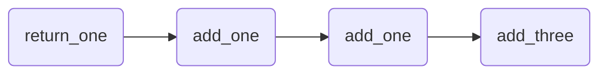

## Graphs (Dagster)
Los grafos representan las conexiones entre Ops mediante dependencias de datos. Las Ops se enlazan definiendo las dependencias que existen entre sus Inputs y Outputs. En Dagster, estas dependencias se expresan como dependencias de datos, no únicamente dependencia de ejecuciones. De esta manera, Dagster no se limita a asegurar únicamente que el orden de ejecución es el correcto, sino que también verifica la carga de datos de las operaciones relacionadas.

